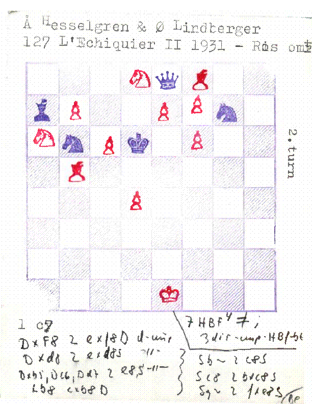
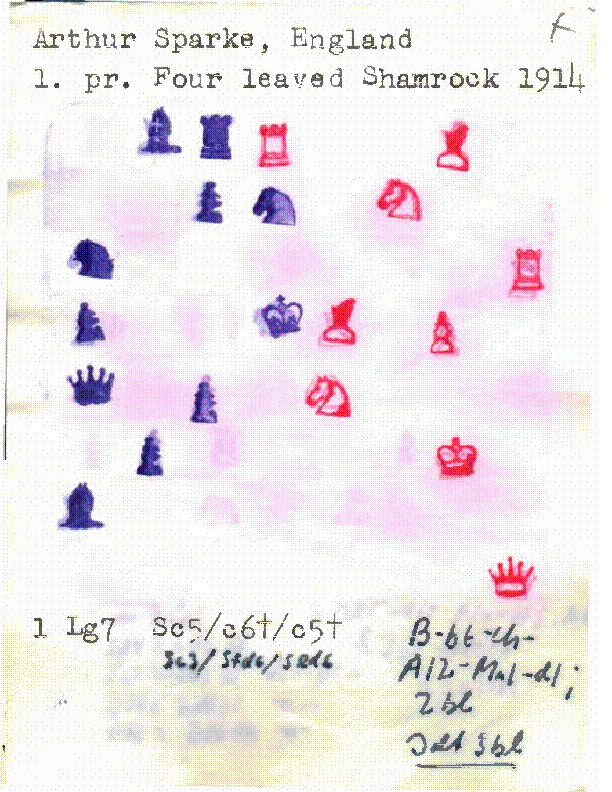

# Chess problem converter 
This is a minor project designed to translate a large quantity of chess problems which have been copied by hand to a digital format.

## Background
My dad, Bjørn Enemark is very much into chess problems an is both an editor for a chess problem magazine a programmer and a well known person in the chess problem society (if such a place exist).
Some years ago someone made him aware of this person who for decades had the peculiar hobby of coping chess problems. This person (I will find the name) copied any chess problem that he would come upon by hand and with a series of small stamps.
The entire collection of these problems are now in the danish national library but my dad has scanned a large quantity of them and a few years ago he asked me if it was a problem I wanted to work on, and yeah.
...but who has the time... So for years... actually for four years (perhaps more) the project just sat there. 

Now (jan 2024) its up and running. 

Still lots to do:
some of the boards look very nice:

while others are a mess. Some ages others with water damage ect:

So the assignment is to :

- Get the png from the pdfs. -done with pdf2image
- Get the board 
- Train a ML model to recognize the different pieces
- Place the pieces on the board, and print the positions to a csv 

- bonus: OCR on the text
- bonus: Often the text is on one side of the pdf and the board with the pieces are on the other.
- bonus: Sometimes there are notes. Idk what to do with that.

There are a total of 50k, but I think I have 5k of them. I don't know how many my dad has scanned