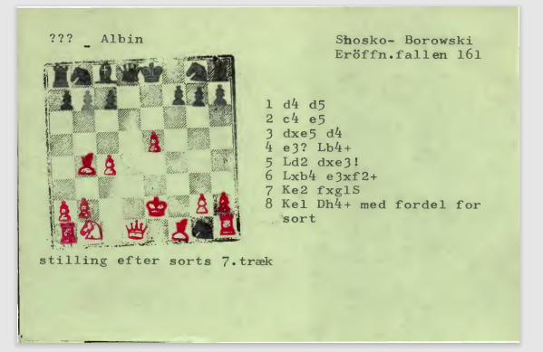
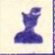
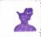
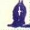
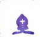

# Chess problem converter 
This is a minor project designed to translate a large quantity of chess problems which have been copied by hand to a digital format.

## Background
My dad, Bjørn Enemark is very much into chess problems an is both an editor for a chess problem magazine a programmer and a well known person in the chess problem society (if such a place exist).
Some years ago someone made him aware of this person who for decades had the peculiar hobby of coping chess problems. This person (I will find the name) copied any chess problem that he would come upon by hand and with a series of small stamps.
The entire collection of these problems are now in the danish national library but my dad has scanned a large quantity of them and a few years ago he asked me if it was a problem I wanted to work on, and yeah.
...but who has the time... So for years... actually for four years (perhaps more) the project just sat there. 

Now (Jan 2024) its up and running (90% succesrate for the first 1000 boards) 
March 2024 98% succesrate for the first 1000 boards.

some of the boards look very nice:


while others are a mess. Some ages others with water damage ect:

(and this is not by far the worst...)

The first 5k boards are almost all them same shape but some are slightly smaller or bigger (and not all are square), but later I will start to tackle 


It is also clear that the person did not do this all alone. That he also collected from friends or perhaps changes stile a few times. Since there are too many different board sizes and different types of stamps for the pieces. The latter makes the classification a lot more difficult.



## Getting started

- Download the repository
- install the requirements file:
```
pip install requirements.txt
```
- Run:
```
Python main.py -m image.png
```
if no parameter is provided the program will run all the png images in the data folder.
```
Python main.py -m 
```

# Training
The models folder stores the models and you can train a new model from the images in the trainingset using:
```
Python main.py -t
```
You can also run the program using verify
```
Python main.py -v
```

## So the assignment is to :
- 
- bonus: OCR on the text
- bonus: Often the text is on one side of the pdf and the board with the pieces are on the other.
- bonus: Sometimes there are notes. Idk what to do with that.